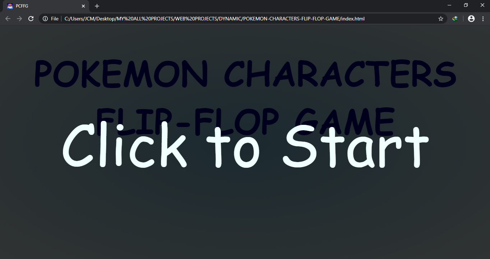
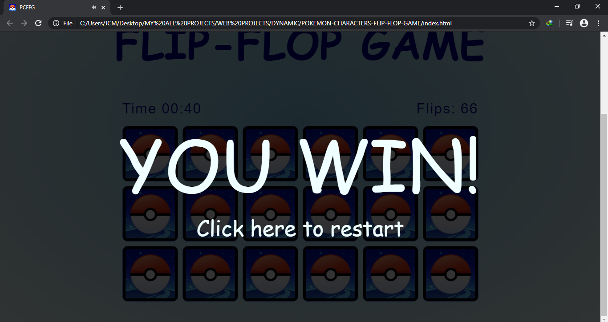
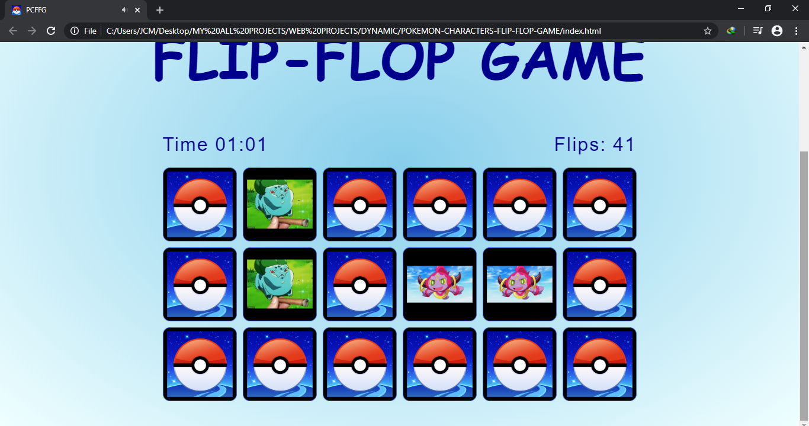
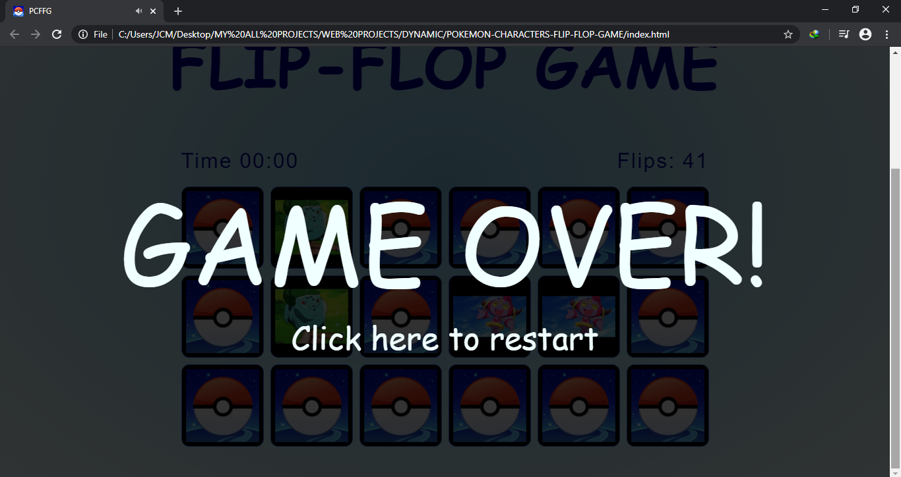

# POKEMON CHARACTERS FLIP-FLOP GAME

* Purpose: My Project
* Front End: HTML5, CSS3, Vanilla JavaScript
* Responsive Web Design: No
* Type of Website: Dynamic (Game)
* Used Audios:  
		-In-game: Jason Paige - Pokémon Theme  
		-Win-game: Vicetone & Tony Igy (Cover by Kiwitunes Harmonica) - Astronomia  
		-Gameover: Rick and Morty - Evil Morty Theme Song (Feewet Trap Remix)    

<h2> User Interface Screenshots </h2> 
  
    
  
  
  
    
  
  
  
    